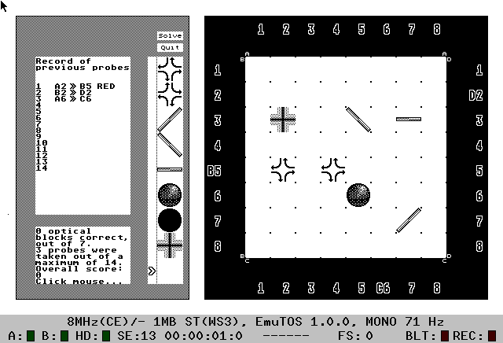

# Reflect: an optical puzzle

## History

I wrote a game in the 1980s on my Atari ST where you fire beams of light to deduce the placement and types of block hidden on an 8x8 grid.
I kept a number of printouts of the code, and recently I scanned them in and [got them running again](history/README.md) on an emulator (Hatari). I was pleased to discover that the game still worked!



However, the game is a real challenge, and my poor brain struggled to solve the puzzle, and eventually I gave up. It seems I had spend a lot of time crafting sprites for the blocks, but I hadn't spent so much time on the gameplay. The last version I had a printout for doesn't generate a new game each time you run it, so I suspect that as the next thing I was going to do, before I stopped working on it. Perhaps I realised that generating good games was difficult.

## Improvements

Over 30 years later I have some thoughts about how to make the game more compelling. The problem with the original is that it is too big: there are too many parameters to keep track of - even with the "notepad" facility where you can arrange blocks on a blank board to try different solutions - so it quickly becomes overwhelming.

So I wondered - what if we reduce the complexity? There are a number of degrees of freedom that we can reduce:

- Board size. The original is 8x8, but I think a much smaller board size is still unpredictable enough to be interesting - say 4x4.
- Number of block types. The original had 8. What if we just had two - the oblique mirrors, say? We could add one or two other blocks later. I also wanted to drop the blocks for "turn left" and "turn right" since they are irreversible - a beam from the opposite direction does not follow the same path. And drop the block that changes the beam colour, as there's enough variety for the moment.
- Number of blocks. This varied in the original, but the example game had 7 blocks to find. Again, we could reduce this to a smaller number, particularly if the board is smaller.
- Maximum number of probes. The original had a maximum number of probes - 14 for the example game. This is an interesting parameter to vary. If it is too small then there is not enough information to solve the game. Too large and it may make the game too easy in some cases. In general it's not easy to set this value. Some probes give very little information, others give a lot, and which ones the player chooses is essentially random (particularly near the start of the game) - and this means you have to be conservative in setting the limit, since it's not the player's fault if they choose badly at the beginning.

The other simplification I thought of was to list the blocks that are in the solution (but without giving their locations obviously). Variations are possible too: just give the number of blocks in the solution, or a mix of the two where some blocks are specified, but others are "wildcards" so their precise identity is not revealed.

I also realised that situations like the following are possible where it is not possible to deduce the block locations, since the two boards are indistinguishable:

```
....  ....
....  ....
...o  ..o.
..o.  ...o
```

To avoid cases like this we could limit the number of mirror balls (and matt black balls), or even perhaps say that indistinguishable boards are not allowed, thereby giving another constraint for the player to use, although it's not clear how easy to apply that would be in practice.

So overall, my idea was to start with very small games that are trivial to solve then turn the parameter knobs up until we reach a level where the game is enough of a challenge to be satisfying, but not _too_ challenging.

Another thing I realised is that it is very difficult to write a computer program to solve these puzzles. It's not constraint propagation like sudoku. The problem has a very non-local feel to it, since a beam can potentially range all over the board. It reminds me of Feynman's integral over all possible paths approach to quantum mechanics. But that doesn't help write a program - it would become combinatorially prohibitive to try each possible path even on a small board with a few blocks.

So my plan is to try setting some puzzles by hand, and to see how I would solve them. That might give some hints about how to write a computer program. Equally, it would hopefully clarify what a satisfying game looked like.

One other insight I had is that this could be a "fixed" puzzle with a selection of beams chosen by the setter, rather than one where the player get to choose which beams to try. This would avoid the problem mentioned above where we have to choose the maximum number of beams to try, and give the setter more control over crafting a puzzle with a certain degree of difficulty. Missing beams would not necessarily mean that there are no blocks there - rather that there is enough information in the other beams to solve the puzzle. One side effect of this approach would be that it's possible to print a puzzle to solve using pen and paper, like a crossword, or sudoku. I like this.

## Tools

Set up an environment

```shell
conda create --name reflect python=3.9
conda activate reflect
pip install -r requirements.txt
```

Run the tests with

```shell
pytest -vs
```

Solve a puzzle

```shell
python solve.py puzzles/puzzle-010.txt
```

Convert a puzzle to a static SVG image:

```shell
python create-svg.py puzzles/puzzle-010.txt > puzzle-010.svg
```
